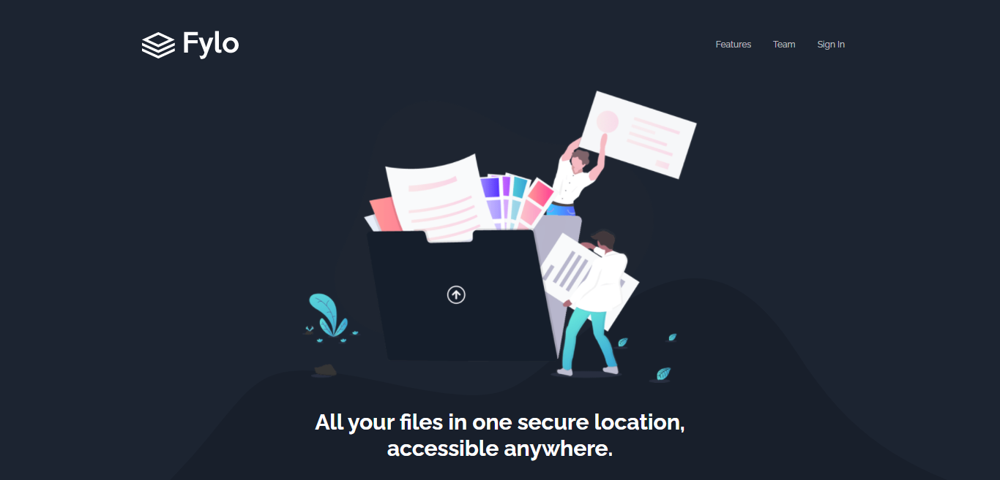
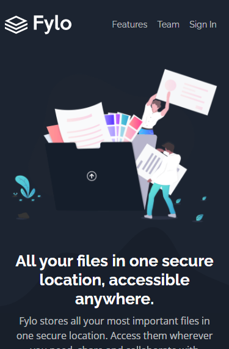

# Frontend Mentor - Fylo dark theme landing page solution with ReactJS

This is a solution to the [Fylo dark theme landing page challenge on Frontend Mentor](https://www.frontendmentor.io/challenges/fylo-dark-theme-landing-page-5ca5f2d21e82137ec91a50fd). 
Frontend Mentor challenges help you improve your coding skills by building realistic projects. 

## Link 
  
### The challenge
Users should be able to:

- View the optimal layout for the site depending on their device's screen size
- See hover states for all interactive elements on the page

### Screenshots

### Links

- Solution URL: [Frontend mentor](https://www.frontendmentor.io/solutions/responsive-landing-page-with-reactjs-9hQT04F8Z)
- Live Site URL: [https://luizlopes12.github.io/Fylo/](https://luizlopes12.github.io/Fylo/)

### Built with

- Semantic HTML5 markup
- CSS custom properties
- Flexbox
- CSS Grid
- Mobile-first workflow
- [React](https://reactjs.org/) - JS library
- [Bootstrap](https://getbootstrap.com/) - CSS library

